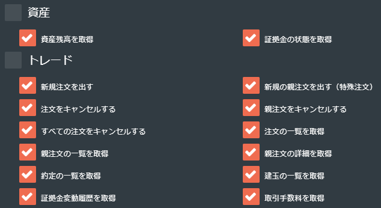

# Channel Breakout Bot for bitflyer-FX
Special Thanks for Snufkin https://sshuhei.com/  
README更新日 2019/1/26  
  
<font size="4">
本ソフトウェアの商用利用を禁止します。<br>
ソースコードを改変した物の販売や、設定パラメータの販売も許可しません。<br>
商用利用が発覚した場合、金1000万円を請求致します。<br>
また、商用利用を行った時点でこの支払に同意したものとみなします。<br>
なお、作者は本ソフトウェアによって生じる一切の損害について責任を負いません。<br>
Commercial use is strictly prohibited.
</font>
  
## インストール方法
※Anacondaによる環境構築は非推奨です。  
1-1) [環境構築スクリプト](https://github.com/Connie-Wild/ubuntu_server_setup) を実行(for ubuntu16.04)  
1-2) [python3.6](https://www.python.org/downloads/windows) をインストール(for Windows10)  
2) ターミナルからgitリポジトリをクローン  
```bash
git clone https://github.com/Connie-Wild/ChannelBreakoutBot.git
```
3) フォルダに移動し、必要なパッケージをインストール  
```bash
cd ChannelBreakoutBot
pip install -U -r requirements.txt
```
4) configフォルダ内の`config_default.json`を`config.json`にリネーム  
5) configフォルダ内の`optimizeList_default.json`を`optimizeList.json`にリネーム  
6) インストールフォルダ内の`blacklist_default.csv`を`blacklist.csv`にリネーム  
7) `key`、`secret`フィールドを、取引所から取得したAPIキー、シークレットに置き換える。  
8) コンソールから起動  
```bash
python trade.py
```
### bitflyerAPIの権限設定
下記の通り、許可を与えて下さい。  
  
## 最新版へのアップデート方法
インストールフォルダでコンソールから以下を実行。  
```bash
git pull
pip install -U -r requirements.txt
```
## 設定
設定は`config.json`ファイルで行います。  
### 全体設定
|Name|Values|Description|
|----|------|-----------|
|product_code|FX_BTC_JPY|取引銘柄の指定。bitflyer-FXのみ対応。|
|key|string|取引所APIのキー|
|secret|string|取引所APIのシークレット|
|line_notify_token|string|[LINE Notify](https://notify-bot.line.me/ja/)による通知を行う場合に、トークンを設定。|
|healthCheck|true/false|取引所のステータスがNORMALとBUSYとVERY BUSY以外の場合、オープンオーダを行わない。(損切りが出来るようにクローズオーダは行う)|
|lotSize|number|注文するBTCの数量を指定する。APIからの最小発注単位が0.01BTCになりました(2018/4/25)。wait機能で1/10のロットになるため、最低値かつ推奨値は0.1。<br>[※注意※]この数値を大きくすればする程、損失と利益の幅が大きくなるため全財産溶かす事になる可能性も上がります。|
|entryTerm|number|entryTerm期間高値/安値を更新したらオープンシグナル点灯|
|closeTerm|number|closeTerm期間、オープン方向と逆に高値/安値を更新したらクローズシグナル点灯|
|rangePercent|number/null|[option]下記参照|
|rangePercentTerm|number/null|[option]rangePercentTerm期間の値幅の平均値を求め、rangePercentを掛けた値をentryTerm/closeTerm期間の高値/安値から加算/減算する。|
|rangeTerm|number/null|[option]下記参照|
|rangeTh|number/null|[option]レンジ相場でのエントリーを減らすために、rangeTerm期間の値幅(rangeTh)または価格の標準偏差の変動でレンジ相場の判定を行う。|
|waitTerm|number|下記参照|
|waitTh|number|rangeTh円以上の値幅を取った場合，次のwaitTermトレードはロットを1/10に落とす。(大きいトレンドのあとの大きなリバや戻りで損をしやすいため)|
|candleTerm|string|ロウソクの期間を指定。1T(1分足)、5T(5分足)、1H(1時間足)。分はT、時はHで示す。|
|cost|number|バックテストおよび、optimizationで利用。遅延等で1トレード毎にcost円分のコストが発生するものとして評価を行う。|
|fileName|string/null|バックテストおよび、optimizationで使用するOHLCデータのファイル名を指定する。デフォルトは`chart.csv`。指定が無い場合は都度取得する。|
|showFigure|true/false|バックテスト実行時にグラフを表示するか選択。コマンドラインのみの環境では`false`にして下さい。|
|sendFigure|true/false|バックテスト結果のグラフをLINE Notifyで通知する。`showFigure`が`false`の場合のみ有効。|
|showTradeDetail|true/false|バックテストの結果として、トレード履歴の詳細を表示する。|
|core|number/null|optimizationで使用するCPUコア数を指定。`null`の場合、全てのコアを利用する。`1`の場合、パラメータ毎の詳細実行結果を表示するが、`2`以上または`null`の場合は、パラメータ毎の実行結果は簡易表示となる。(全てのコアを利用するとCPU使用率が100%に張り付くため、全体コア数-1の値を設定する事をオススメする。)|
|hyperopt|number|機械学習によるoptimizationにて試行するテスト数を指定する。|
|mlMode|string|機械学習で最適値を求める項目を選択する。<br>PL:利益 PF:利益率 DD:ドローダウン <br>WIN:勝率 PFDD:利益率/ドローダウン <br>EV:期待値[勝率 * 平均利益 - (1-勝率) * 平均損失]|
|useBlackList|true/false|optimization時にブラックリストを使用する。<br>マイナス収益のパラメータをブラックリストに登録し、次回以降該当パラメータはスキップする。|
|keepPosition|true/false|`true`の場合、前回終了時のポジションを引き継ぐ|
|sfdLimit|true/false|現物とFXの乖離率が4.9%を超える場合、超える方向へのエントリーを制限する。|
## バックテスト
別途取得したOHLCデータ`fileName`を元にバックテストを行う。  
`fileName`の指定が無い場合は`cryptowat.ch`から都度取得する。  
```bash
python backtest.py
```
## optimization
別途取得したOHLCデータ`fileName`を元に最適な設定値の探索を試みる。  
`fileName`の指定が無い場合は`cryptowat.ch`から都度取得する。(都度取得すると時間がかかる上に同じOHLCデータでの比較が出来ないので`fileName`の指定をする事をオススメします。)  
自動設定はされないため、探索した値を利用したい場合は`config.json`に設定する必要あり。  
パターンデータには`optimizeList.json`を利用する。  
```bash
python optimization.py
```
## 機械学習によるoptimization
hyperoptを用いてTree-structured Parzen Estimator Approach（TPE）ロジックによる最適値の算出を試みる。  
パターンデータには`optimizeList.json`を利用する。  
```bash
python machineLearning.py
```
## optimization用のパターンデータの用意
設定は`optimizeList.json`ファイルで行います。  
### パターンデータ
|Name|Values|Description|
|----|------|-----------|
|linePattern|string|FIX:`entryAndCloseTerm`のパターンを使用。<br>COMB:2から`termUpper`までの正数の組み合わせを自動生成し、[entryTerm,closeTerm]のパターンとして使用。|
|termUpper|number|2以上で指定。|
|entryAndCloseTerm|number|[entryTerm,closeTerm]で指定。|
|rangeThAndrangeTerm|number/null|[rangeTh,rangeTerm]で指定。|
|waitTermAndwaitTh|number|[waitTerm,waitTh]で指定。|
|rangePercentList|number/null|[rangePercent,rangePercentTerm]で指定。|
|candleTerm|number|[candleTerm]で指定。|
## optimization用のOHLCデータの取得
コマンドライン引数に取得したい日付と取得時間足を指定する事が出来る。  
時間足：1分足 = 60 , 1時間足 = 3600  
日付：yyyy-mm-dd  
例)5分足を最新から6000件取得する。  
`ohlc_get.py 300`  
例)2018-04-05の5分足を取得する。  
`ohlc_get.py 300 2018-04-05`  
引数を指定しない場合、1分足データを6000件取得する。  
```bash
python ohlc_get.py > chart.csv
```
## FAQ
### Q.どんな設定値を使えば利益を出せますか？
A. バックテスト等を利用し、ご自身で探して下さい。  
